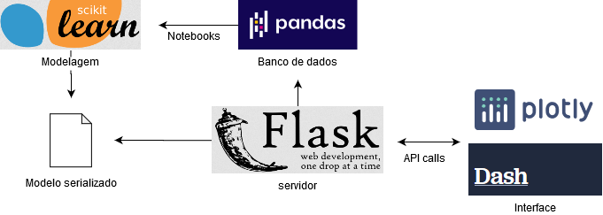

# projeto-ml-codenation

Projeto de machine learning em sistemas de recomendação, parte da [aceleração Codenation Data Science](http://codenation.dev).

## Objetivo

O objetivo deste produto é fornecer um serviço automatizado que recomenda leads para um usuário dado sua atual lista de clientes (Portfólio).

## Contextualização

Algumas empresas gostariam de saber quem são as demais empresas em um determinado mercado (população) que tem maior probabilidade se tornarem seus próximos clientes. Ou seja, a sua solução deve encontrar no mercado quem são os leads mais aderentes dado as características dos clientes presentes no portfólio do usuário.

## Arquitetura

